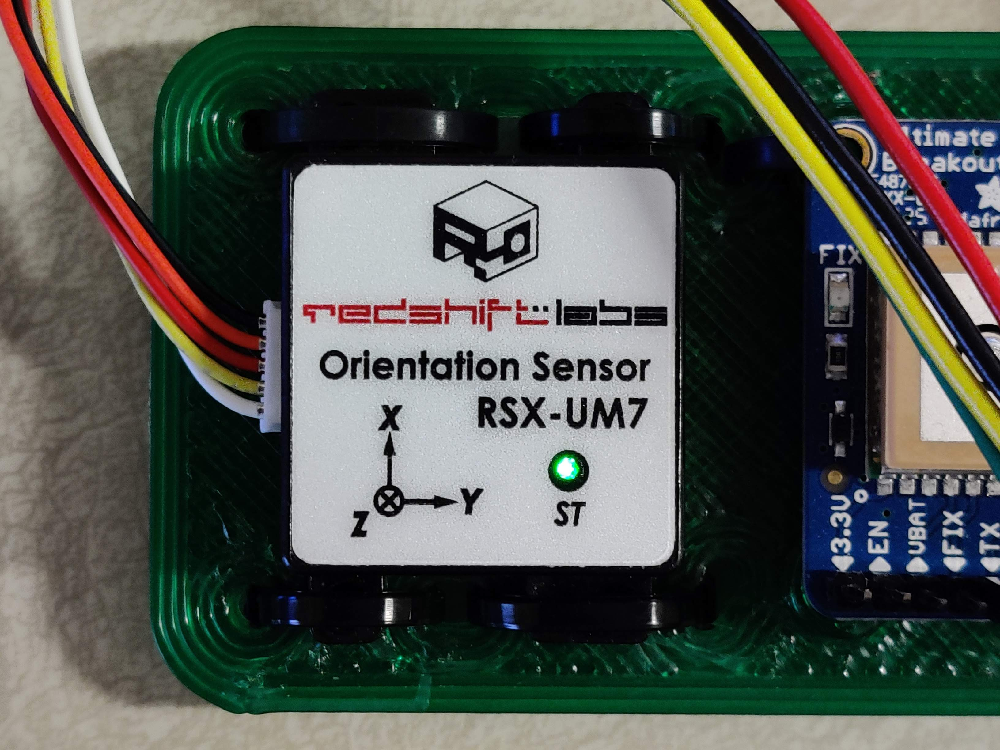

# Redshift Labs RSX-UM7 Inertial Measurement Unit

## Quick start

To get started with the RSX-UM7 IMU, [read through this quick-start guide here](https://www.redshiftlabs.com.au/um7-quick-start-guide)

## Calibration

To calibrate the RSX-UM7 IMU, [read through this calibration procedure here](https://www.redshiftlabs.com.au/um7-calibration-procedure)

## ROS Node

To install the ROS `um7` package, [see the package wiki here](http://wiki.ros.org/um7)

[The Github repository can be found here](https://github.com/ros-drivers/um7)

If you need a refresher on how to install ROS packages, [see our tutorial here](https://github.com/riplaboratory/Kanaloa/blob/master/Tutorials/SoftwareInstallation/ROS/InstallingPackages/README.md)

## Coordinate Systems (THIS IS IMPORTANT)

The RSX-UM7 sensor internally employs a x-forward, y-right, z-down coordinate system.  This is the coordinate system printed on top of the sensor.  It looks something like this: 

Using the Redshift Serial Interface software, we have confirmed that this coordinate system is consistent for the accelerometer, rate gyroscope, and fused output.  

Recall that the [ROS Enhancement Protocol (REP) 103](https://www.ros.org/reps/rep-0103.html) convention suggests that that axis orientation in relation to a body should be x-forward, y-left, z-up.  This is different from the coordinate system internal to the UM7, but this is not problematic, as a single coordinate transform is straightforward to implment in a package utilizing this information.

What _is_ problematic, is that, at the time of writing (2019/07/16), the [`um7` ROS package](http://wiki.ros.org/um7) adopts an inconsistent coordinate system for the various sensors and fused output from the UM7.  Testing the direct outputs of the ros node, we noted the following coordinate systems

 - __orientation quaternion converted to Euler angles assuming ZYX rotation order:__ x-left, y-forward, z-down
 - __angular_velocity:__ x-forward, y-left, z-up
 - __linear_acceleration:__ x-forward, y-left, z-up
 - __rpy:__ x-right, y-forward, z-up
 
Therefore, when viewing topics from the `um7` ROS package, be very careful to check that it matches the coordinate system you're using in your own code!
