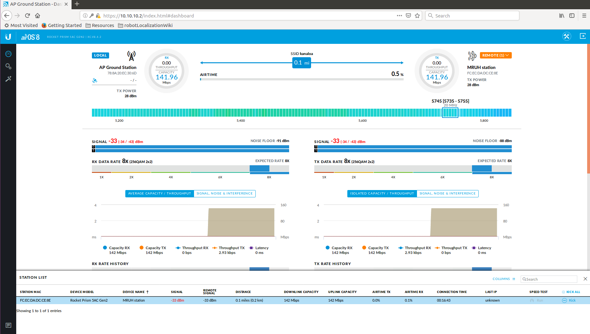
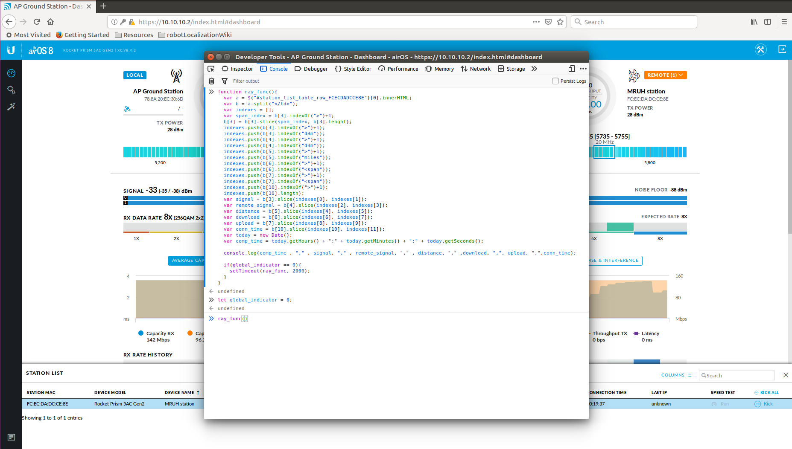
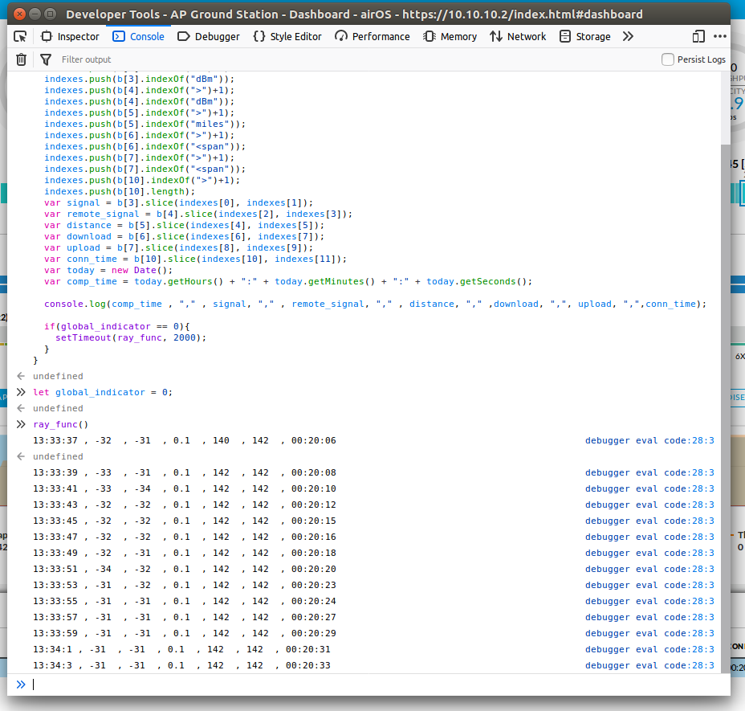

# Ubiquity User Dashboard Information Scraper
This script takes data from the Ubiquity prism dashboard and relays key data back with a timestamp. The main purpose of this script is to log connection info so that it can in turn be paired with a GPS sensor data to see the correlation between distance between communications relays and their signal strength.

## Prerequisites
1.  A Internet Browser

## Hardware Setup

- Power Ubiquity Prism using POE connector
- Connect LAN to computer via Ethernet
- Ensure the computer is connected to that Ethernet connection
- Power on second Ubiquity prism
- Ensure the two prisms connect to each other by checking the indicator lights
- Start roscore on host computer
- Run ROS Launch files to publish GPS data

## Running the Ubiquity Scraper Script

1) Open a web browser on the computer and type in IP of Ubiquity prism (e.g.: `10.10.10.2` for workstation 1)

2) Log in to the Ubiquity dashboard

3) In the top right corner, click the orange drop down button, and ensure status table is displaying at bottom of web page.



4) Open the inspector console of the browser (Ctrl + Shift + I)

5) Click on the console tab

6) Paste in the code from ubiquityScrapper.js (or at the bottom of this page)

7) When you are ready to start the script create and set a global_indicator variable to 0. `let global_indicator = 0;`

8) Then type in `ray_func()`, the results should begin printing to the screen



9) To stop the function set the global_indicator variable to any other value but 0. `global_indicator = 1;`

10) Export results by right clicking on the console output and selecting either Copy All or Save As (depending on your browser)




## Running the GPS Scraper Script

1) Ensure the GPS' are publishing data over ROS

2) Run the `gpsScraper.js` script in terminal

```bash
cd path/to/Kanaloa/Tutorials/UbiquityScrapper/
nodejs ubiquityScrapper.js
```

3) To stop the script hit Ctrl + C in terminal.

4) View data in `gps_log.csv`


## Code for ubiquityScrapper

```javascript
global_indicator = 1

function ray_func(){
 if(global_indicator == 0){
  var a = $("#station_list_table_row_FCECDADCCE8E")[0].innerHTML;
  var b = a.split("</td>");
  var indexes = [];
  var span_index = b[3].indexOf(">")+1;
  b[3] = b[3].slice(span_index, b[3].lenght);
  indexes.push(b[3].indexOf(">")+1);
  indexes.push(b[3].indexOf("dBm"));
  indexes.push(b[4].indexOf(">")+1);
  indexes.push(b[4].indexOf("dBm"));
  indexes.push(b[5].indexOf(">")+1);
  indexes.push(b[5].indexOf("miles"));
  indexes.push(b[6].indexOf(">")+1);
  indexes.push(b[6].indexOf("<span"));
  indexes.push(b[7].indexOf(">")+1);
  indexes.push(b[7].indexOf("<span"));
  indexes.push(b[10].indexOf(">")+1);
  indexes.push(b[10].length);
  var signal = b[3].slice(indexes[0], indexes[1]);
  var remote_signal = b[4].slice(indexes[2], indexes[3]);
  var distance = b[5].slice(indexes[4], indexes[5]);
  var download = b[6].slice(indexes[6], indexes[7]);
  var upload = b[7].slice(indexes[8], indexes[9]);
  var conn_time = b[10].slice(indexes[10], indexes[11]);
  var today = new Date();
  var comp_time = today.getHours() + ":" + today.getMinutes() + ":" + today.getSeconds();

  console.log(comp_time , "," , signal, "," , remote_signal, "," , distance, "," ,download, ",", upload, ",",conn_time);
 }
  if(global_indicator == 0){
    setTimeout(ray_func, 2000);
  }
}

p = function(){
  if(global_indicator == 0){ global_indicator = 1}
  else{
    global_indicator = 0
    ray_func()}
}
```

## Notes

- The script is set to extract the connection info every 2 seconds (or 2000 milliseconds), this can be changed in the script by editing the script at `setTimeout(ray_func, 2000);`, where 2000 can be changed to your desired time in milliseconds.

- The data returned is as follows: `[Timestamp, Ground_Station Signal, Second Router Signal, Estimated Distance, Download Speed, Upload Speed, Connection Time]`

- When you copy or save the output from the console, note it will also copy the code you set in the beginning. Make sure to delete these first couple lines to ensure your file only contains Ubiquity data.

- The output is formatted to work as a CSV file. When saving the output, just use the file extension `.csv`, and it will be able to be imported into most spreadsheet software.

- The GPS Scraper is set to log the topics `/mruhGps` and `/fix`. To change this, go into the `gpsScraper.js` script and change the names in the following code

```javascript
sub = rosNode.subscribe('/mruhGps', sensor_msgs.NavSatFix,
  (data) => { // define callback execution
    gps1_lat = data.latitude
    gps1_long = data.longitude
  }
);

sub2 = rosNode.subscribe('/fix', sensor_msgs.NavSatFix,
  (data) => { // define callback execution
    gps2_lat = data.latitude
    gps2_long = data.longitude
  }
);
```

- The GPS Scraper rate at which it save GPS coordinates is set to 2000 milliseconds, this can be changed in the following portion of code

```javascript
function log_gps_data(){
  setTimeout(log_gps_data, 2000);  //repeat function every 2 seconds
```
