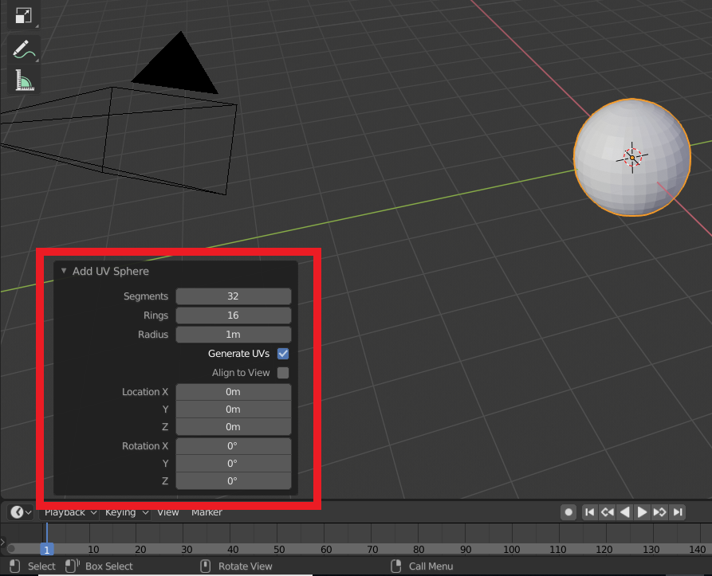
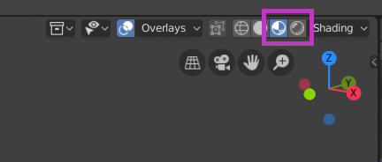
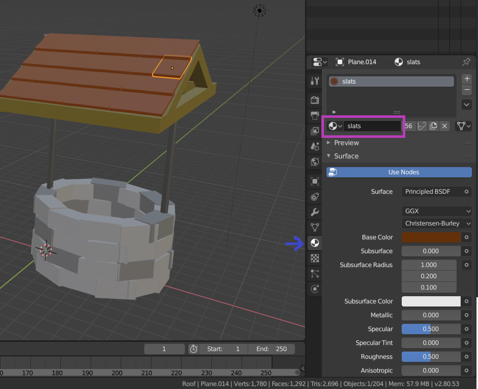

# Blender Notes
Blender is a free animation software that lets you design 3D forms as well as animate them. The new release of Blender 2.80, which revamped the entire UI.

## Prerequisites
- None

## Installation
Go to https://www.blender.org/download/ to get the download for your OS, follow the installation instructions.

## Getting Started
When you first start blender you should see a screen like this if your are in a version earlier than 2.8

Blender 2.8 should look something like the image below, although it may slightly differ since at the time of writing Blender 2.8 is still in Beta

## Key Bindings and Shortcuts
| Binding           | Description                                   |
| :---:             | :----:                                        |
| Left MB           | Select                                        |
| Right MB          | Object Context Menu                           |
| Middle MB         | Rotate View                                   |
| Shift + Middle MB | Rotate View                                   |
| Ctrl + Middle MB  | Rotate View                                   |
| x                 | Brings up delete dialog of selected item      |
| n                 | Toggle 3D editors properties toolbox          |
| t                 | Toggle 3D viewpoint toolboar                  |
| Ctrl + A          | Apply/Set Toolbox (Scale, Rotation, etc)      |
| Shift + D         | Duplicate Object                              |
| x                 | Delete option box                             |
| Delete            | Delete currently selected objects (no confirmation)|
| g (+ x, y, z)     | Translate Selected Object                     |
| s (+ x, y, z)     | Scale Selected Object                         |
| r (+ x, y, z)     | Rotate Selected Object                        |
| Shift + A         | Add Menu                                      |
| m                 | Move selected objects to collection           |
| Ctrl + L          | Make Links to selected objects (materials, animations, etc)|
| Shift + L         | Select All objects based on similar characteristic         |

## Creating an Object
To create a new objects, simply go over to the upper left portion of the screen to the add toolbar. From there you can select between what type of geometry or object to add. The added object will be placed wherever the target cursor is (red and white circle). Once the object is added, a small properties bar will appear in the lower left corner to edit the properties of the object.  

## Associating a Material to Object

